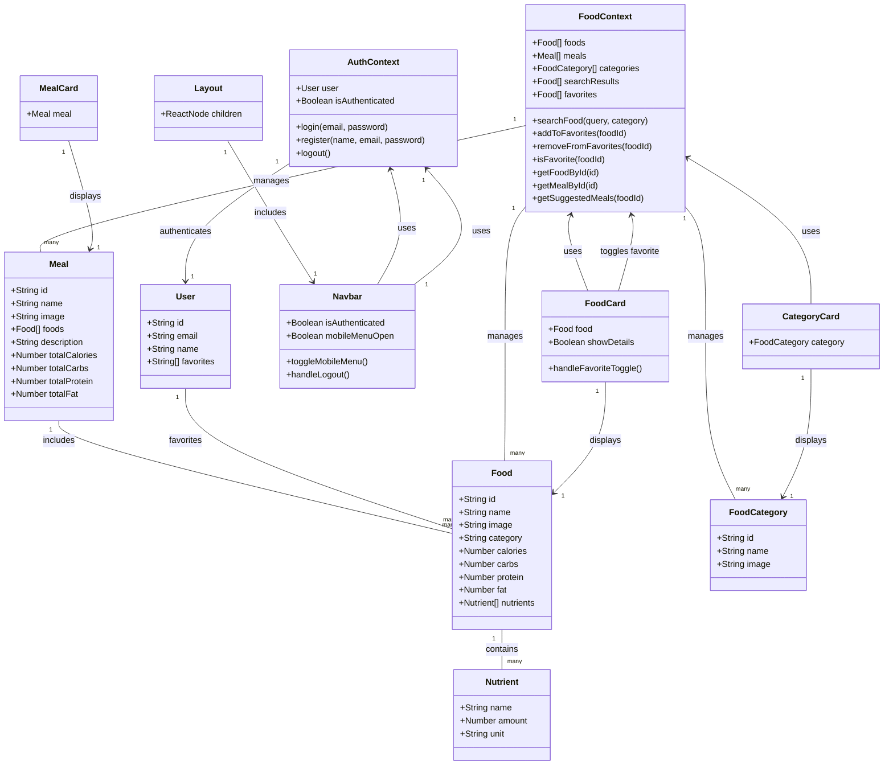

```mermaid
classDiagram
    %% Core Types
    class User {
        +String id
        +String email
        +String name
        +String[] favorites
    }

    class Food {
        +String id
        +String name
        +String image
        +String category
        +Number calories
        +Number carbs
        +Number protein
        +Number fat
        +Nutrient[] nutrients
    }

    class Meal {
        +String id
        +String name
        +String image
        +Food[] foods
        +String description
        +Number totalCalories
        +Number totalCarbs
        +Number totalProtein
        +Number totalFat
    }

    class Nutrient {
        +String name
        +Number amount
        +String unit
    }

    class FoodCategory {
        +String id
        +String name
        +String image
    }

    %% Context Classes
    class AuthContext {
        +User user
        +Boolean isAuthenticated
        +login(email, password)
        +register(name, email, password)
        +logout()
    }

    class FoodContext {
        +Food[] foods
        +Meal[] meals
        +FoodCategory[] categories
        +Food[] searchResults
        +Food[] favorites
        +searchFood(query, category)
        +addToFavorites(foodId)
        +removeFromFavorites(foodId)
        +isFavorite(foodId)
        +getFoodById(id)
        +getMealById(id)
        +getSuggestedMeals(foodId)
    }

    %% UI Components
    class Layout {
        +ReactNode children
    }

    class Navbar {
        +Boolean isAuthenticated
        +Boolean mobileMenuOpen
        +toggleMobileMenu()
        +handleLogout()
    }

    class FoodCard {
        +Food food
        +Boolean showDetails
        +handleFavoriteToggle()
    }

    class MealCard {
        +Meal meal
    }

    class CategoryCard {
        +FoodCategory category
    }

    %% Relationships
    Food "1" -- "many" Nutrient : contains
    Meal "1" -- "many" Food : includes
    User "1" -- "many" Food : favorites

    FoodContext "1" -- "many" Food : manages
    FoodContext "1" -- "many" Meal : manages
    FoodContext "1" -- "many" FoodCategory : manages

    AuthContext "1" --> "1" User : authenticates

    Layout "1" --> "1" Navbar : includes
    Navbar "1" --> "1" AuthContext : uses

    FoodCard "1" --> "1" Food : displays
    FoodCard --> FoodContext : toggles favorite
    MealCard "1" --> "1" Meal : displays
    CategoryCard "1" --> "1" FoodCategory : displays

    FoodContext <-- FoodCard : uses
    FoodContext <-- CategoryCard : uses

    AuthContext <-- Navbar : uses
```